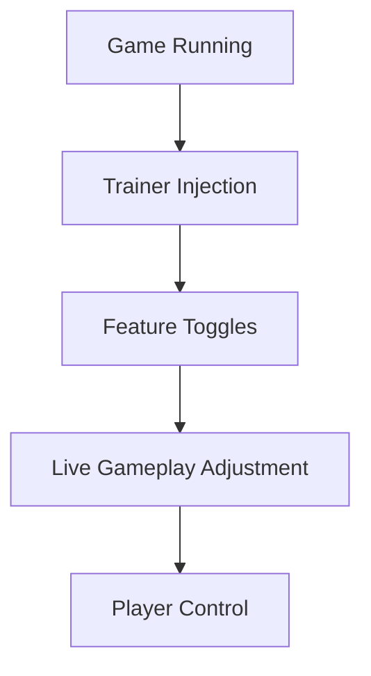

# Bellwright Trainer 

In **Bellwright**, time is heavy.
Every log carries weight. Every hunger bar ticks like a quiet drum. The world does not rush — it *expects* patience.

And yet, sometimes the hands that build kingdoms deserve relief.

The **Bellwright Trainer** is not here to shatter immersion, but to *reshape pacing*. It allows you to bend difficulty, smooth progression, and explore the medieval survival sandbox on your own terms — without rewriting the soul of the game.

---

## Overview 🏹

Designed specifically for **Bellwright**, this trainer is a PC utility that injects real-time gameplay controls directly into the running game.

It offers players the ability to:

* Adjust survival pressure
* Accelerate settlement growth
* Experiment freely with combat and crafting
* Reduce grind without skipping content

Think of it as a dial — not a switch.

---

## Core Features ⚙️

The Bellwright Trainer focuses on *practical power*. No bloated menus, no chaos — just tools that respect the game loop.

### 🛡️ Player & Survival Controls

Because survival should be challenging, not exhausting.

* God Mode / Infinite Health
* Unlimited Stamina
* Hunger & Thirst Freeze
* No Fall Damage

Perfect for:

* Exploration
* Testing builds
* Long sessions without fatigue

---

### 🪓 Resources & Crafting

Let creativity replace repetition.

* Infinite Resources
* Instant Crafting
* No Material Costs
* Building without limits

Your village grows by vision — not by grind.

> [!NOTE]
> Resource tools are best used thoughtfully to preserve progression balance.

---

### ⚔️ Combat Tweaks

Power, precisely applied.

* One-Hit Kills
* Damage Multiplier
* Enemy Health Control
* AI Behavior Softening

Ideal for:

* Practice runs
* Base defense testing
* Cinematic combat moments

---

### 🏰 World & Progression

Shape the rhythm of the realm.

* Game Speed Control
* XP Multiplier
* Skill Level Adjustments
* Time-of-Day Control

The world bends — but never breaks.

---

## Why Use a Trainer in Bellwright? 🌲

Because Bellwright is deep — sometimes *too* deep.

**Creative freedom**

* Focus on village design
* Experiment with systems
* Learn mechanics faster
* Reduce early-game friction

**Technical benefits**

* Real-time toggles
* Hotkey-driven controls
* Clean injection method
* Easy enable / disable during play

This trainer doesn’t remove challenge — it lets you *choose* it.

---

## Typical Usage Flow 🔧

1. Launch Bellwright
2. Start or load a save
3. Run Bellwright Trainer as administrator
4. Enable desired features via hotkeys
5. Adjust on the fly while playing

No restart loops.
No locked states.
Control remains fluid.

---

## Trainer Logic Flow 🧠

Everything happens in real time — quietly, cleanly.

---

## FAQ ❓

**Is Bellwright Trainer safe to use?**
For offline, single-player use — yes.

**Will it break my save?**
Used responsibly, no. Avoid extreme values mid-quest.

**Can I toggle features on/off anytime?**
Yes — that’s the core design.

**Does it work after game updates?**
Trainer versions are updated to match major patches.

**Is it suitable for beginners?**
Absolutely — especially for learning mechanics.

> [!WARNING]
> Avoid using trainers in multiplayer or online-connected modes.

---

## Final Thoughts 🌄

Bellwright is about reclaiming land, rebuilding trust, and shaping a future from raw soil.

The **Bellwright Trainer** doesn’t take that journey away — it simply lightens the pack on your back.

Use it to learn.
Use it to create.
Use it when the grind grows louder than the story.

A kingdom should rise from vision — not exhaustion.

---
